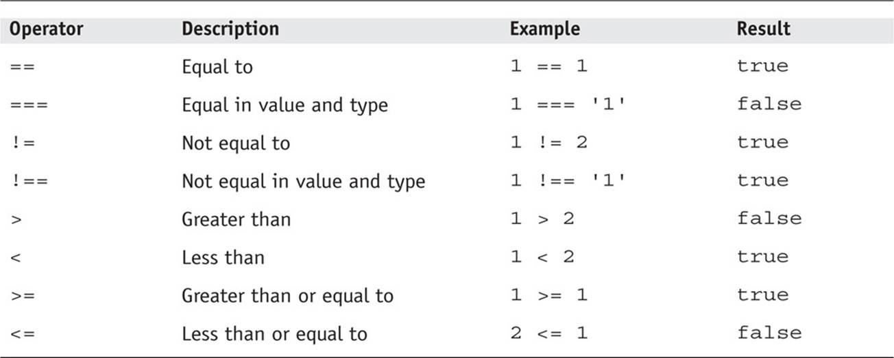
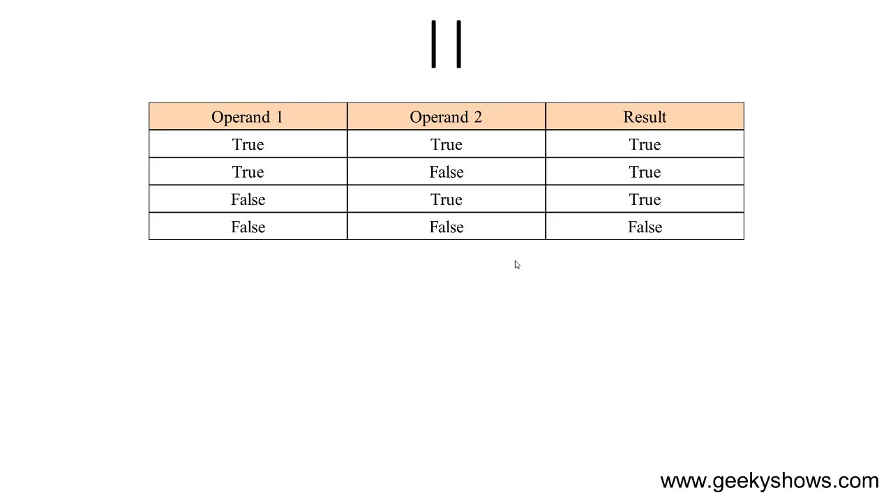
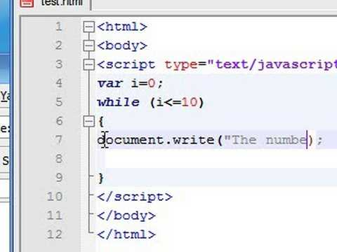
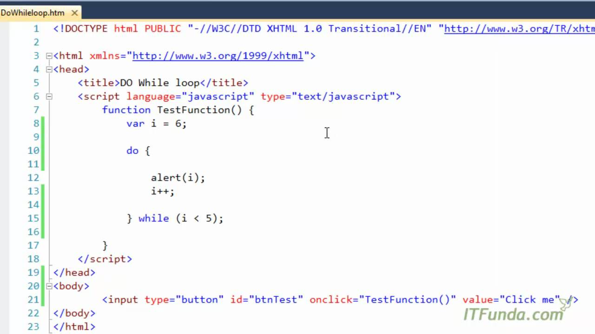

# comparison operators evalateng conndtion

# LOGICAL Operators and Expressions 

Logical operators are typically used with Boolean (logical) values; when they are, they return a Boolean value. However, the && and || operators actually return the value of one of the specified operands, so if these operators are used with non-Boolean values, they may return a non-Boolean value.

 

# loops
 
 Loops are used in JavaScript to perform repeated tasks based on a condition. Conditions typically return true or false when analysed. A loop will continue running until the defined condition returns false.

 

JavaScript supports different kinds of loops: ... for/of - loops through the values of an iterable object. while - loops through a block of code while a specified condition is true. do while - also loops through a block of code while a specified 

 
 
 # while Loops

 The while statement evaluates the expression before each iteration of the loop.

If the expression evaluates to true, the while statement executes the statement. If the expression evaluates to false, execution continues with the statement after the while loop.

The while loop evaluates the expression before each iteration, therefore, the while loop is known as a pretest loop. For this reason, it is possible that the statement inside the while loop is never executed.

 

 # do/while

 The do/while statement creates a loop that executes a block of code once, before checking if the condition is true, then it will repeat the loop as long as the condition is true. The do/while statement is used when you want to run a loop at least one time, no matter what.

 

