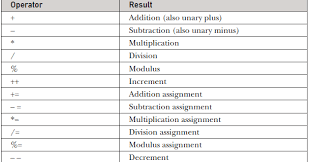
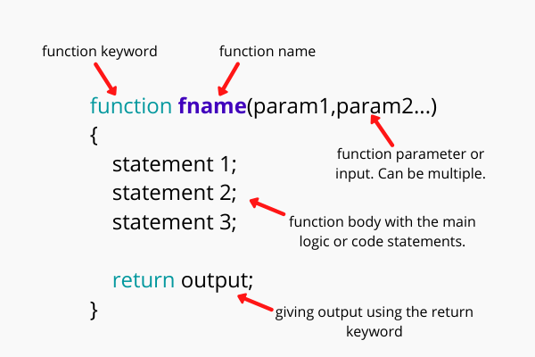

# How javasecript mack web pages more interactive
Access content 
Modify content
Program Rules
React to the eveant 
# What is the SCRIPT
A script is a series of instructions that a
computer can follow to achieve a goal. 
# Each time the script runs, it might only use a subset of
all the instructions. 
# Computers approach tasks in a different way than
humans, so your instructions must let the computer
solve the task prggrammatically. 
# To approach writing a script, break down your goal into
a series of tasks and then work out each step needed
to complete that task 

  # EXPRESSIONS 
  An expression evaluates into (results in) a single value. Broadly speaking
  there are two types of expressions. 
  1 EXPRESSIONS THAT JUST ASSIGN A
     VALUE TO A VARIABLE 
  2 EXPRESSIONS THAT USE TWO OR
     MORE VALUES TO RETURN A
     SINGLE VALUE 

  # OPERATORS 
  Expressions rely on things called operators; they allow programmers to
  create a single value from one or more values. 

  # ARITHMETIC OPERATORS 
 

 # STRING OPERATOR 
 There is just one string operator: the+ symbol.
It is used to join the strings on either side of it.  

# FUNCTION 
JavaScript functions are defined with the function keyword.

 a function is a "subprogram" that can be called by code external (or internal in the case of recursion) to the function. Like the program itself, a function is composed of a sequence of statements called the function body. Values can be passed to a function, and the function will return a value

 

