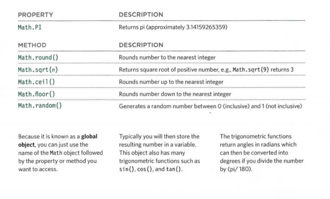

# Tables 
- HTML tables allow web developers to arrange data into rows and columns.

 # Define an HTML Table
 The <table> tag defines an HTML table.

Each table row is defined with a <tr> tag. Each table header is defined with a <th> tag. Each table data/cell is defined with a <td> tag.

By default, the text in <th> elements are bold and centered.

By default, the text in <td> elements are regular and left-aligned. 
 
 # table Heading 
HTML <th> Tag 
A simple HTML table with three rows, two header cells and four data cells:

# A simple HTML table with three rows, two header cells and four data cells:

# spanning-columns. 

HTML <td> colspan Attribute

 

 he colspan attribute in HTML specifies the number of columns a cell should span. It allows the single table cell to span the width of more than one cell or column. It provides the same functionality as “merge cell” in the spreadsheet program like Excel.

Usage: It can be used with <td> and <th> element while creating an HTML Table.

<td>: The colspan attribute when used with <td> tag determines the number of standard cells it should span.
Syntax:
<td colspan = "value">table content...</td> 

# spanning-rows 

The rowspan attribute in HTML specifies the number of rows a cell should span. That is if a row spans two rows, it means it will take up the space of two rows in that table. It allows the single table cell to span the height of more than one cell or row. It provides the same functionality as “merge cell” in the spreadsheet program like Excel.

Usage: It can be used with <td> and <th> element in an HTML Table.

<td>: The rowspan attribute when used with <td> tag determines the number of standard cells it should span.
Syntax:
<td rowspan = "value">table content...</td>

# Long Tables 
There are three elements that
help distinguish between the
main content of the table and
the first and last rows (which can
contain different content). 

These elements help people
who use screen readers and also
allow you to style these sections
in a different manner than the
rest of the table (as you will see
when you learn about CSS). 
<thead>
The headings of the table should
sit inside the <thead> element.
<tbody>
The body should sit inside the
<tbody> element.
<tfoot>
The footer belongs inside the
<tfoot> element. 

#[img](https://i.pinimg.com/originals/09/dd/b9/09ddb953d624771b2b21abeb7ed3699b.jpg)

# Width & Spacing 

The width attribute was used
on the opening <table> tag to
indicate how wide that table
should be and on some opening
<th> and <td> tags to specify
the width of individual cells.
The value of this attribute is
the width of the table or cell in
pixels.
The columns in a table need to
form a straight line, so you often
only see the width attribute on
the first row (and all subsequent
rows would use that setting). 

# THE DOCUMENTOBJECT MODEL:
- THE DOCUMENT OBJECT 
 
 The topmost object in the Document Object Model (or DOM) is the
document object. It represents the web page loaded into the current
browser window or tab. 
The Document Object Model (DOM) is the data representation of the objects that comprise the structure and content of a document on the web. In this guide, we'll briefly introduce the DOM. We'll look at how the DOM represents an HTML or XML document in memory and how you use APIs to create web content and applications. 
The Document Object Model (DOM) is a programming interface for HTML and XML documents. It represents the page so that programs can change the document structure, style, and content. The DOM represents the document as nodes and objects. That way, programming languages can connect to the page. 
A Web page is a document. This document can be either displayed in the browser window or as the HTML source. But it is the same document in both cases. The Document Object Model (DOM) represents that same document so it can be manipulated. The DOM is an object-oriented representation of the web page, which can be modified with a scripting language such as JavaScript. 

# USING THE DOCUMENT OBJECT  

This representation of the document is one of the toys that a JavaScript program has available in its sandbox. It is a data structure that you can read or modify. It acts as a live data structure: when it’s modified, the page on the screen is updated to reflect the changes. 
- 1. The details about the page are
collected from properties of the
document object. 
- 2 You have seen the document
object's get El ementByid ()

# String 

The String object is used to represent and manipulate a sequence of characters.

Strings are useful for holding data that can be represented in text form. Some of the most-used operations on strings are to check their length, to build and concatenate them using the + and += string operators, checking for the existence or location of substrings with the indexOf() method, or extracting substrings with the substring() method.

 # String Methods and Properties
 Primitive values, like "John Doe", cannot have properties or methods (because they are not objects).

But with JavaScript, methods and properties are also available to primitive values, because JavaScript treats primitive values as objects when executing methods and properties. 

- String Length
The length property returns the length of a string 
 - Finding a String in a String
 
 The indexOf() method returns the index of (the position of) the first occurrence of a specified text in a string

 The lastIndexOf() method returns the index of the last occurrence of a specified text in a string:

 Both indexOf(), and lastIndexOf() return -1 if the text is not found.

 # Searching for a String in a String
 The search() method searches a string for a specified value and returns the position of the match:

 # Extracting String Parts
 The slice() Method
slice() extracts a part of a string and returns the extracted part in a new string.

The method takes 2 parameters: the start position, and the end position (end not included). 

If a parameter is negative, the position is counted from the end of the string 

The substring() Method
 
 substring() is similar to slice().

The difference is that substring() cannot accept negative indexes.
The substr() Method
 substr() is similar to slice().

The difference is that the second parameter specifies the length of the extracted part.
# Replacing String Content
 The replace() method does not change the string it is called on. It returns a new string. 
 # The replace() method does not change the string it is called on. It returns a new string. 
 A string is converted to upper case with toUpperCase():

A string is converted to lower case with toLowerCase():

The concat() Method
concat() joins two or more strings:

The concat() method can be used instead of the plus operator. These two lines do the same:

# GLOBAL OBJECTS: MATH OBJECT  

 